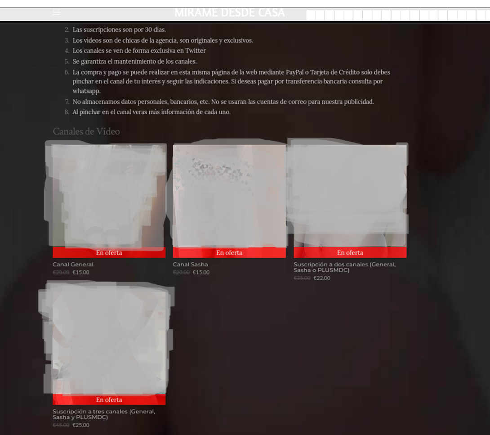
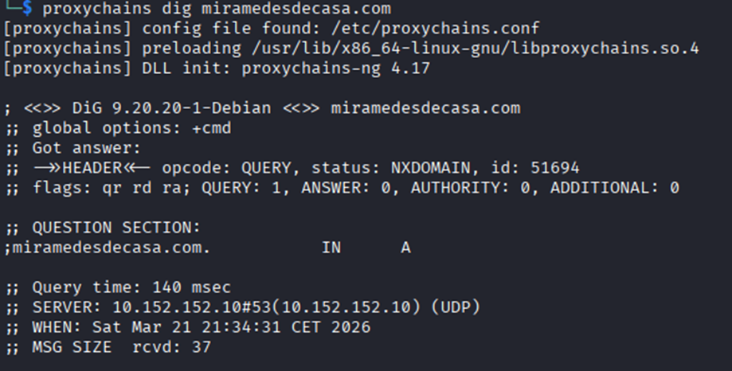
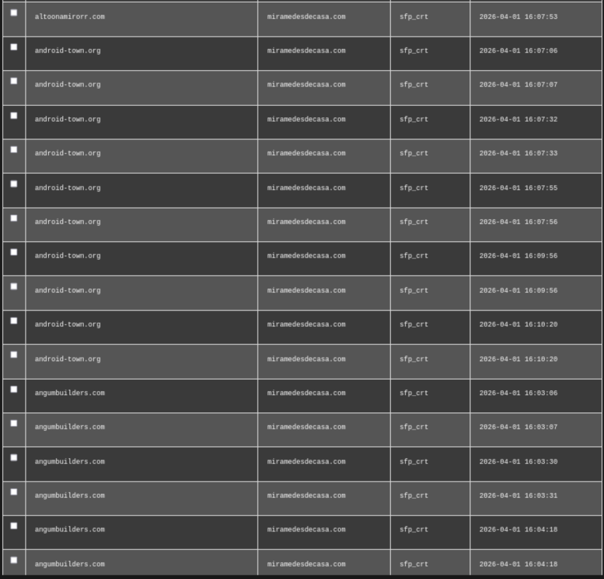
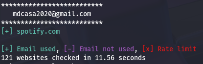

# OSINT Investigation: Suspicious Recruitment Case  

This repository documents an OSINT (Open Source Intelligence) investigation focused on a **suspicious recruitment activity** linked to multiple platforms, phone numbers, and online services.  

The objective of this project is to analyze patterns, correlate data, and reconstruct the operational model using **non-intrusive OSINT techniques**.  

---

## Overview  

The investigation started from a seemingly legitimate job offer that quickly revealed inconsistencies.  

Through structured analysis, the case exposed:  

- A **central communication node (phone number)**  
- Presence across multiple platforms  
- Use of **rotating phone numbers**  
- Lack of persistent infrastructure  
- Repeated behavioral patterns  

---

## Key Findings  

- Phone numbers act as the **core of the operation**  
- No stable digital identity or infrastructure  
- Distributed presence across platforms  
- Evidence of **evasive and adaptive behavior**  
- Clear recruitment → redirection → escalation pattern  

Full analysis:  
- [`analysis/findings.md`](./analysis/findings.md)

---

## Methodology  

The investigation follows a **passive OSINT methodology** based on:  

- Public data collection  
- Cross-platform correlation  
- Behavioral analysis  
- Tool-assisted enumeration  

No intrusive or illegal techniques were used.  

Full methodology:  
- [`analysis/methodology.md`](./analysis/methodology.md)

---

## Investigation Timeline  

The investigation was conducted step by step, documenting how each discovery led to the next.  

- Initial job offer identification  
- Phone number pivoting  
- Platform correlation  
- Number rotation detection  
- Pattern consolidation  

Full timeline:  
- [`analysis/timeline.md`](./analysis/timeline.md)

---

## Repository Structure  

```text
.
├── analysis/
│   ├── findings.md
│   ├── methodology.md
│   └── timeline.md
│
├── data/
│   ├── domains.txt
│   ├── email.txt
│   └── phones.txt
│
└── evidence/
    ├── ads/
    │   ├── facebook_post_recruitment.png
    │   ├── web_listing_services.png
    │   └── web_services_offers.png
    │
    ├── chats/
    │   ├── whatsapp_contact_info.png
    │   ├── whatsapp_debt_claim.png
    │   └── whatsapp_payment_excuses.png
    │
    └── screenshots/
        ├── domain_nxdomain.png
        ├── external_victim_testimony_agata.png
        ├── facebook_contact_details.png
        ├── facebook_profile_mdc.png
        ├── facebook_profile_overview.png
        ├── forum_spalumi_complaint.png
        ├── google_search_3_phone.png
        ├── google_search_phone_main.png
        ├── google_search_secondary_phone.png
        ├── social_profile_inactive.png
        ├── spiderfoot_cohosted_domains.png
        ├── spiderfoot_username_trabajochicasmadrid.png
        ├── technical_ip_result.png
        ├── tool_holehe_email_analysis.png
        ├── tool_theharvester_no_results.png
        ├── twitter_complaint_agata.png
        ├── twitter_profile.png
        └── twitter_recruitment_post.png
```
---

## Evidence Samples  

### Recruitment Content  

  

---

### WhatsApp Interaction  

  
  
  

---

### Web & Services  

  
  

---

### OSINT & Technical Analysis  

  
  
  
  
  

---

## Key Indicators  

The following elements were consistently linked across the investigation:  

- Phone numbers  
- Domain: `miramedesdecasa.com`  
- Email: `mdcasa2020@gmail.com`  
- Social media accounts  

These elements only become meaningful when analyzed **together**, not individually.  

---

## ⚠️ Disclaimer  

This project is based entirely on:  

- Open Source Intelligence (OSINT)  
- Publicly available data  
- Provided materials  

No claims of illegal activity are made.  
All conclusions are **analytical and non-conclusive**.  

---

## Final Insight  

> The operation does not rely on infrastructure, but on communication.  

By avoiding persistence and rotating identifiers, the activity achieves:  

- Low traceability  
- High adaptability  
- Operational continuity  

---

## About This Project  

This project was developed as part of a learning process in:  

- Cybersecurity  
- OSINT investigations  
- Pattern analysis  
- Real-world case studies  
